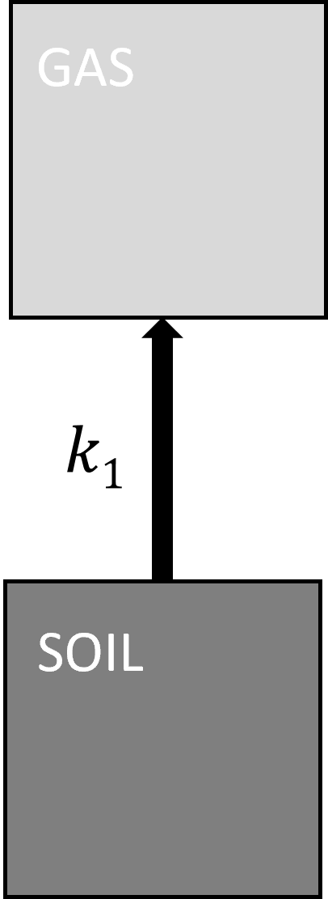
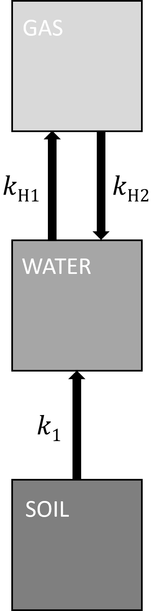

```{r ggplot theme}
#| include: false
#| warning: false
#| echo: false

library(ggplot2)
theme_min<-theme(axis.text.x=element_text(vjust=0.2, size=18, colour="black"),
                 axis.text.y=element_text(hjust=0.2, size=18, colour="black"),
                 axis.title=element_text(size=20, colour="black"),
                 axis.line = element_line(linewidth = 1.2, color = "black"),
                 strip.text=element_text(size=16, face="bold"),
                 axis.ticks.x.top = element_line(color = "black"),
                 axis.ticks.y.right = element_line(color = "black"),
                 axis.ticks.length=unit(-0.05, "cm"),
                 panel.background=element_blank(),
                 panel.border = element_rect(linewidth = 1.2, fill = NA),
                 panel.grid=element_blank(),
                 legend.text=element_text(size=18, colour="black"),
                 legend.title=element_text(size=18, colour="black"),
                 legend.key.size=unit(1, "cm"),
                 strip.background=element_rect(fill="grey98", colour="black"),
                 legend.key=element_rect(fill="white", linewidth=1.2),
                 plot.title=element_text(size=28, face="bold", hjust=-0.05))

```

# When an equilibrium is not established {#sec-noEq}

**The impact of kinetic constraints on** $CO_2$ **measurements in wet samples**

In an incubation experiment, we aim to measure the rate of $CO_2$ production as a change of $CO_2$ concentration over time. This process can be simplified and represented as the release of $CO_2$ from soil at the rate $k_1$.

{#fig-noWater fig-alt="more text" fig-align="center" width="90"}

The degradation of soil organic carbon by microbial activity $\frac{dC}{dt}$ can be approximated by first-order decay equation $\frac{dC}{dt} = -k_1 \times C$ with the rate constant $k_1$ to obtain explicit solution:

$$C(t) = C_0 \times  e^{-k_1 \times t}$$ {#eq-degradation}

where $C_0$ is the amount of degradable organic carbon in the incubated soil (in $\frac{mol}{L}$), $t$ is the time in seconds, and $k_1$ has the unit $\frac{1}{s}$. In this simple model, the $CO_2$ produced at the rate $k_1 \times C(t)$ is directly released into the gas phase (see @fig-noWater).

# The effect of water and equilibrium violation

If incubated soil samples contain water, the scheme shown in @fig-noWater is too simplistic. When $CO_2$ accumulates in a closed container, the amount of $CO_2$ in the aqueous phase is accordingly high, and if this fraction of $IC$, is not considered, $CO_2$ production rates are underestimated as described above. This is especially relevant when soils with different moisture contents are compared. But yet, there is another effect that can lead to faulty results: $CO_2$ is not only released from the incubated sample; the $CO_2$ gas from the headspace can dissolve into the aqueous phase of the incubated sample. In the scheme depicted in figure 18, this is indicated by the two arrows $k_{H1}$ and $k_{H2}$. To obtain reliable results, the two flux rates $k_{H1}$ and $k_{H2}$ must be balanced. In other words: the $CO_2$ concentrations of the gas phase and the aqueous phase of the incubation sample must be in equilibrium. So far, the presence of equilibrium was an implicit assumption. Now, the more detail kinetic will be considered to identify conditions at which the equilibrium assumption may be violated. Reaching the equilibrium depends on diffusion and convection rates. These rates can be influenced by the size of the interface at which $CO_2$ can travel between aqueous and gas phase and on turbulence (e.g. stirring).

{#fig-model fig-alt="more text" fig-align="center" width="90"}

# Modelling the kinetic effect of water in incubation experiments

In the following, we will derive the linear differential equations to express the scheme shown in @fig-model mathematically:

Microbial activity produces $CO_2$ from degradable organic carbon ($C$) with the rate constant $k_1$. But now, $CO_2$ will not be released directly into the gas phase, but dilute in the aqueous phase:

$$ C \xrightarrow[]{k_1 \times C} CO_{2}(aq)^{*}$$ {#eq-CO2soiltoaq}

$CO_2$ in the aqueous phase will outgas with the rate constant $k_{H1}$ to the gas phase:

$$ CO_{2}(aq)^{*} \xrightarrow[]{k_{H1} \times CO_{2}(aq)^{*}} CO_{2}(gas)$$ {#eq-CO2aqtogas}

And $CO_2$ in the gas phase will, as well, dissolve in the aqueous phase with the rate constant $k_{H2}$:

$$ CO_{2}(g)    \xrightarrow[]{k_{H2}\times CO_{2}(gas)}  CO_{2}(aq)^{*}$$ {#eq-CO2gastoaq}

The $CO_2$ transport within the aqueous phase and over the phase boundary can be rather complicated as it involves e.g. convection and diffusion. These equations are thus simplified representations describing these processes as first order reactions with rate constants $k_{H1}$ and $k_{H2}$, respectively. The ratio of both fluxes defines the Henry’s law constant $K_H$ for the $CO_2$ equilibrium concentrations in water. Here we use the dimensionless Henry constant, which uses the amount of $CO_2$ in the gas phase divided by the amount of $CO_2$ in the aqueous phase both in $\frac{mol}{L}$.

$$ K_H = \frac{k_{H1}}{k_{H2}} = \frac{CO_{2}(gas)}{CO_{2}(aq)^{*}}$$ {#eq-KH}

## differential expressions

The chemical reactions described above are implemented as a system of coupled linear differential equations. The rate expressions for the three species degradable carbon $C$ in the soil sample ($c_C$), $CO_2$ in the aqueous phase ($c_{aq}$), and $CO_2$ in the gas phase ($c_{g}$) are:

$$ \frac{d c_C}{dt} = - k_1 \times c_C$$ {#eq-diff_soil}

$$ \frac{d c_{aq}}{dt} = k_1\times c_C - k_{H1}\times c_{aq} + k_{H2}\times c_g$$ {#eq-diff_water}

$$ \frac{d c_g}{dt} = \left(k_{H1}\times c_{aq} - k_{H2}\times c_g\right) \times \frac{V_{s}}{V}$$ {#eq-diff_gas}

Here $c_C$ corresponds to the total organic carbon (TOC) in the water phase, as the volume of the dry soil sample is neglected or rather approximated by the water volume. $V_{s}$ and $V$ are again the volumes of the water and the gas phase, respectively. The volume ratio of water and gas phase has to be regarded as their size determine their capacity to hold $CO_2$.

The system of three differential equations is implemented in R. In the first step, the equations are written in the function `CHenry`. In a second step, the function `CHenry` is enclosed in the wrapper function `wrapperCmess` where input-parameters such as starting conditions, time, rate constants and $CO_2$ reservoir volumes are included as parameters. With this `wrapperCmess` function, single incubation measurements can be simulated.

**Interested reader can display both functions below:**

`CHenry`

```{r}
#| echo: true
#| warning: false
#| code-fold: true

# differential equations

## CO2 reservoirs
# S - C amount in soil [mol]
# W - CO2 in the water [mol]
# G - CO2 in the gas phase [mol]

## rate constants
# k1 - microbial degradation rate [1/s]
# kh1  speed of CO2 going from W to G [1/s]
# kh1/KH = kh2 speed of CO2 going from G to W [1/s]

## reservoirs voulmes
# Vw - volume of water phase [l]
# Vg - volume of gas phase [l]

# t - modelled time [s]

CHenry<-function(t, Cstart, rate) {
  with(as.list(c(Cstart, rate)),{
    # microbial CO2 production
    dS <- -k1*S
    # CO2 in water
    dW <-  k1*S - kh1*W + (kh1/KH)*G # note that kh1/KH = kh2
    # CO2 in gas (what we measure)
    dG <- kh1*(Vw/Vg)*W - (kh1/KH)*(Vw/Vg)*G
    # output:
    list(c(dS, dW, dG))
  })   
}

```


`wrapperCmess`

```{r}
#| echo: true
#| warning: false
#| code-fold: true


# wrapper function to define the input for CHenry

library(deSolve)

wrapperCmess = function(
## input: all parameters 
    time, S, W, G, k1, kh1, Vw, Vg){
  # time vector
  time = time
  # start conditions
  Cstart = c(S=S, W=W, G=G)
  # flux rate constants
  rate = c(k1=k1, kh1=kh1)
## output: results in various units (e.g ppm)
  # save into results
  result = as.data.frame(ode(func=CHenry, y=Cstart, parms=rate, times=time))
  # time in h
  result$time_h = result$time/3600
  # CO2 in gas in ppm, for easier comparability
  result$G_ppm = (result$G *1000*R*Temp) / (101325 *1e-6)
  # hypothetical CO2 concentraion in water as ppm, for comparability
  result$hypW_ppm = (result$W * (Vw/Vg)*1000*R*Temp) / (101325 *1e-6)
  return(result)
}


```


# Simulation of the effect of $CO_2$ solubility in incubation measurements

## Different initial conditions

Let's simulate four incubation cases, where the main parameters do not change (namely amount of degradable organic C, decomposition rate constant $k_1$, $V_s$ and $V$). The initial conditions for the $CO_2$ concentration in the aqueous and gas phase, as well as the transport speed over the water-gas phase boundary vary.

**Fixed parameters** include the general gas constant $R$, the incubation temperature $T$ in Kelvins and the Henry constant $K_H$. Here $K_H$ is transformed by the general gas law to get the value with no unit.

```{r}
#| code-fold: true

## set fixed parameters

# general gas constant [(kg * m²)/(s² * mol * K)]
R = 8.31446261815324
# Temperatur from C to K
CinK = 273.15
# temperature [K]
Temp = 20 + CinK 


# Henry Constant in p_g/c_aq [l*atm/mol]
KH = 29
# Henry Constant in c_g/c_aq [no unit]
KH =round( (KH * 0.001 * 101325) / (R*Temp), 3)
```

**Incubation specific parameters** that do not change in the following simulation include the volume of the headspace $V$ and parameters describing the incubated soil sample: sample weight ($P$) in grams, nondimensional sample water content ($P_w$) and the relative amount of organic carbon ($P_{TOC}$), and the decomposition constant $k_1$.

```{r}
#| code-fold: true

## Experimental parameters

# Gas volume of measurement set up
Vg = 0.28 # [l]


# Soil sample [g]
P = 20   
# Water content []
P_w = 0.9   
# TOC-content of Soil sample []
P_TOC = 0.45  

# total amount of water [g]
W = P*P_w  
# Volume of water [l]
Vw = W / 1000    

# dry Soil sample [g]
C_g = P * (1-P_w)
# degradable Carbon [mol]
C = C_g*P_TOC/12/Vw

### microbial degradation rate
# microbial degradation rate [mg(CO2) / g(Soil) day]
m = 1.02 
# 1 day in sec [s]
day=24*60*60 
# degradation rate per sec [1/s] 
k1 =  (m * 1e-3 * 12/44 *1/P_TOC) * 1/day
```

The only variables that change are the **initial conditions**. These include the $CO_2$ concentrations in the gas ($G$) and aqueous ($W$) phase as well as the rate at which $CO_2$ travels between the gas phase and the incubated sample ($k_{H1}$), e.g. in other words if the sample is stirred. The higher $k_{H1}$ the faster the system will be equilibrated. The time ($t$) for this simulation is set to 15 minutes.

```{r}
#| code-fold: true
  
## Variable parameters 

# CO2 in the gas-phase [ppm]
ppm_g = c(800, 400, 800, 800) 
# CO2 in gas [mol/l]
G = (ppm_g *1e-6*101325)/(R*Temp*1000)  

# water phase eqilibrated to CO2 in [ppm]
ppm_w = c(400, 800, 400, 100) 
# CO2 in the water [mol/l]
W=((ppm_w *1e-6*101325)/(R*Temp*1000))/KH 

# total C-CO2 in the System [mol]
C_ges_sys_mol = C*Vw + W*Vw + G*Vg   

# degas rate = how fast equilibrium is reached
kh1 = c(0.01, 0.01, 0.2, 0.001) 

# combine variable parametes
run <- c('A', 'B', 'C', 'D')
inputFrame <- data.frame(run,
                    ppm_g, G,
                    ppm_w, W,
                    kh1)

## run simulation 
t=900 # 15 min in [s]

simulate <- list()

for (i in 1:4){
  simulate[[run[i]]] <- wrapperCmess(
    time=seq(0, t, by = 1),
    S=C, 
    W=inputFrame$W[i], 
    G=inputFrame$G[i], 
    k1=k1, 
    kh1=inputFrame$kh1[i], 
    Vw=Vw, 
    Vg= Vg)
  }


```

The concentrations of $CO_2$ in the gas phase are shown as a function of time. All four graphs depicted are realizations of the `wrapperCmess` function. The red line is a linear regression trough two points of the simulated measurements, as an example of a manual measurement (e.g. at a GC) after 5 seconds and a second measurement after 12 minutes.

```{r}
#| message: false
#| warning: false
#| code-fold: true


fitting <- data.frame(run,rep(k1*C*(Vw/Vg), 4))
colnames(fitting) <- c('run', 'CO2prod_mol/ls')

for (i in 1:4){
  linfullfit <- lm(G~time, data = simulate[[i]][c(5,720),]) # time in s: 5 and 720=12min
  fitting$fullLin_intercept[i] <- linfullfit$coefficients[1]
  fitting$fullLin_slope[i] <- linfullfit$coefficients[2]
  }

p1 <- ggplot(simulate[[1]], aes(x=time, y=G*1e6)) +
    geom_line() + 
    theme_min +
    xlab("Time (s)")+
    ylab(expression(paste(Headspace~CO[2], " (", mu, "mol ", L^{-1}, ")")))+
    geom_abline(intercept = fitting$fullLin_intercept[1]*1e6, slope = fitting$fullLin_slope[1]*1e6, col='red')+
    labs(title = expression(paste("A) G = 800 ppm W = 400 ppm ", k[H1], " = 0.01 ", s^{-1}))) +
    theme(plot.title = element_text(size = 14))
p2 <- ggplot(simulate[[2]], aes(x=time, y=G*1e6)) +
    geom_line() + 
    theme_min +
    xlab("Time (s)")+
    ylab(expression(paste(Headspace~CO[2], " (", mu, "mol ", L^{-1}, ")")))+
    geom_abline(intercept = fitting$fullLin_intercept[2]*1e6, slope = fitting$fullLin_slope[2]*1e6, col='red')+
    labs(title = expression(paste("B) G = 400 ppm W = 800 ppm ", k[H1], " = 0.01 ", s^{-1}))) +
    theme(plot.title = element_text(size = 14))
p3 <- ggplot(simulate[[3]], aes(x=time, y=G*1e6)) +
    geom_line() + 
    theme_min +
    xlab("Time (s)")+
    ylab(expression(paste(Headspace~CO[2], " (", mu, "mol ", L^{-1}, ")")))+
    geom_abline(intercept = fitting$fullLin_intercept[3]*1e6, slope = fitting$fullLin_slope[3]*1e6, col='red')+
    labs(title = expression(paste("C) G = 800 ppm W = 400 ppm ", k[H1], " = 0.2 ", s^{-1}))) +
    theme(plot.title = element_text(size = 14))
p4 <- ggplot(simulate[[4]], aes(x=time, y=G*1e6)) +
    geom_line() + 
    theme_min +
    xlab("Time (s)")+
    ylab(expression(paste(Headspace~CO[2], " (", mu, "mol ", L^{-1}, ")")))+
    geom_abline(intercept = fitting$fullLin_intercept[4]*1e6, slope = fitting$fullLin_slope[4]*1e6, col='red')+
    labs(title = expression(paste("D) G = 800 ppm W = 100 ppm ", k[H1], " = 0.001 ", s^{-1}))) +
    theme(plot.title = element_text(size = 14))


```

```{r}
#| label: fig-simulations
#| fig-height: 10
#| fig-width: 10
#| echo: false
#| fig-cap: "Simulations of headspace $CO_2$ flux with two different initial concentrations of headspace $CO_2$ (G): 400 (panel B) and 800 panels (A, C and D) ppm, three different initial concentrations of $CO_{2}(aq)^{*}$ (W): 100 (panel D), 400 (panels A and C) and 800 (panel B) ppm, and three different kinetic constants $k_{H1}$ (see eqs. 70 and 71): 0.001 (panel D), 0.01 (panels A and B) and 0.2 (panel C) $s^{-1}$. The solid black and red lines represent the model simulation and the linear regression performed against the simulations, respectively." 


library(gridExtra)

grid.arrange(grobs=list(p1, p2, p3, p4))

```


Note that all four graphs in @fig-simulations look different in the beginning, although the incubation sample is always the same. After an initial phase a linear slope occurs (black line). The slope of the linear increase is the same for all four graphs, and related to the microbial degradation of degradable organic carbon to $CO_2$.

In graph A, the concentration of $CO_2$ in the gas phase is relatively high compared to the concentration in the aqueous phase of the sample. In this case the $CO_2$ concentration decreases in the first minutes of the incubation. The opposite case is shown in graph B. Here, the $CO_2$ concentration of the aqueous phase was high, leading to a degassing into the gas phase and a steep increase of $CO_2$ concentrations. Measurements in the first minutes of this incubation would give false results.

In graph C the rate constant $k_{H1}$ is very high, here the gas and the aqueous phase of the sample are equilibrated within few seconds. In graph D, the rate constant $k_{H1}$ is low, thus the first ten minutes of the incubation are not showing results that are related to the microbial degradation of organic carbon.

## Modelling all system components (aqueous and gas phase)

This model allows us to investigate the behavior of $CO_2$ concentrations in the aqueous phase of the incubation sample (@fig-compo): it follows the behavior of the $CO_2$ concentrations in the gas phase in opposite direction. When the starting conditions are not in equilibrium, the observed change (the transitional phase), in the beginning relates to the establishment of a Henry equilibrium. If the simulation is run for 3 days (@fig-compo B) the concentration ratio of $CO_2(g)$ and $CO_2(aq)$ approached the Henry's equilibrium constant $K_H$. 


```{r}
#| label: fig-compo
#| fig-height: 6
#| fig-width: 10
#| echo: false
#| fig-cap: "Simulations of inorganic C in aqueous ($CO_2(aq)$ solid grey line) and gas ($CO_2(aq)$ solid black line) phase for two different time intervals: A) 0 and 700 seconds; B) 0 and 72 hours. The solid light blue line represents tha ratio between $CO_2(g)$ and $CO_2(aq)$ (see eq. 68)." 

layout((matrix(1:2, ncol =2, nrow=1)), height =c(1)) # plots nebeneinander

i=1
minuten <- 12*60
SymA <- wrapperCmess(time=seq(0, minuten, by = minuten/15000),S=C, W=inputFrame$W[i], G=inputFrame$G[i], k1=k1, kh1=inputFrame$kh1[i], Vw =Vw, Vg= Vg)
SymA$GW <- (SymA$G)/(SymA$W)

par(mar=c(5,5,3,4))
plot(G~time, data = SymA,
     ylim=c(1.5e-5, max(SymA$G)),
     #main ="A: 12 minutes",
     xlab = 'Time (s)', ylab = expression(paste('Inorganic C (mol ', L^{-1}, ")")),
     cex.lab = 1,
     col = '#333333',
     lwd = 2,
     lty = 1,
     type='l')
lines(W~time, data = SymA, col = '#888888', lty = 1, lwd = 2)
par(new=TRUE)
plot(GW~time, data = SymA, ylim =c(0.8, 1.8),
     xlab ='', ylab='',xaxt='n', yaxt='n',
     col = '#0D9FD9', lty = 2, type='l', lwd = 1.5)
axis(side= 4, col = '#0D9FD9', col.axis ='#0D9FD9' )
title("A")
#mtext('concentration ratio', side =4, line =2, cex=1, col = '#0D9FD9')


dreitage <- 3*day
SymA <- wrapperCmess(time=seq(0, dreitage, by = dreitage/15000),S=C, W=inputFrame$W[i], G=inputFrame$G[i], k1=k1, kh1=inputFrame$kh1[i], Vw =Vw, Vg= Vg)
SymA$GW <- SymA$G/SymA$W

par(mar=c(5,5,3,4))
plot(G~time_h, data = SymA,
     ylim=c(1.5e-5, max(SymA$G)),
     #main ='A: three days',
     xlab = 'Time (h)', 
     ylab = NA,
     cex.lab = 1,
     col = '#333333',
     lwd = 2,
     lty = 1,
     type='l')
lines(W~time_h, data = SymA, col = '#888888', lty = 1, lwd = 2)
par(new=TRUE)
plot(GW~time_h, data = SymA,ylim =c(0.8, 1.8),#ylim =c(0.95, 1.1),
     xlab ='', ylab='',xaxt='n', yaxt='n',
     col = '#0D9FD9', lty = 2, type='l', lwd = 1.5)
axis(side= 4, col = '#0D9FD9', col.axis ='#0D9FD9' )
mtext('concentration ratio', side = 4, line =2, cex=1, col = '#0D9FD9')
title("B")

legend('bottomright', bty = 'n',
       legend = c(bquote(~CO[2](g)~""), 
                  bquote(~CO[2](aq)*~""), 
                  as.expression(bquote("ratio"~CO[2](g)/CO[2](aq)~""))), 
       col = c('#333333', '#888888', '#0D9FD9'), 
       cex=0.8, lty = c(1,1,2), lwd = c(2,2,1.5), y.intersp=1.5)


#dev.off()
```


